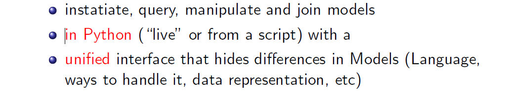
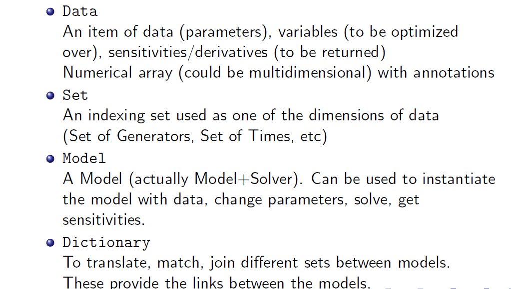

.. CESIAPI documentation master file, created by
   sphinx-quickstart on Sun Apr 19 21:46:33 2020.
   You can adapt this file completely to your liking, but it should at least
   contain the root `toctree` directive.

Welcome to CESIAPI's documentation!
===================================

~~~~~~~~~~~~~~~~~~~~~~~~~~~~~~~~~~~~~~~~~~~~~~~~~~~~~~~~~~~~~~~
About this  Integrated Modelling Environment (IME) project
~~~~~~~~~~~~~~~~~~~~~~~~~~~~~~~~~~~~~~~~~~~~~~~~~~~~~~~~~~~~~~~

The project will create a an **Integrated Modelling Environment** (IME) that facilitates interaction of models from different disciplines using different methodologies (optimization, simulation, quantitative/qualitative) and written in different languages.

**The aim of this projec is to enable model user**

**The common tasks one might want to do with a model from this IME is:**

**A set of Python objects that wrap around a given model or its componentsis created as**

**The most fundamental tasks that can be complimenshied by our devloped API are:**

.. code-block:: python

    modop = new Model('ModelAnnotationFile');
    modop.readData('PathTotheDataFile');
    modop.solve();
    modop.getObjectiveValue();
    modop.getParam(`ParameterName').values();

~~~~~~~~~~~~~~~~~~~~~~~~~~~~~~~~~~~~~~~~~~~~~
API class and functions Reference
~~~~~~~~~~~~~~~~~~~~~~~~~~~~~~~~~~~~~~~~~~~~~

.. toctree::
   :maxdepth: 2
   :caption: API class and functions Reference

   API

~~~~~~~~~~~~~~~~~~~~~~~~~~~~~~~~~~~~~~~~~~~~~
Indices and tables
~~~~~~~~~~~~~~~~~~~~~~~~~~~~~~~~~~~~~~~~~~~~~

* :ref:`genindex`
* :ref:`modindex`
* :ref:`search`
